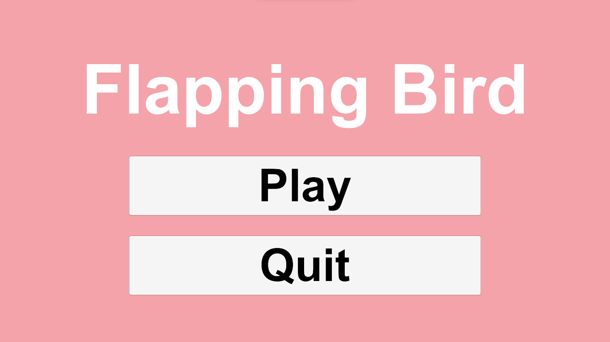
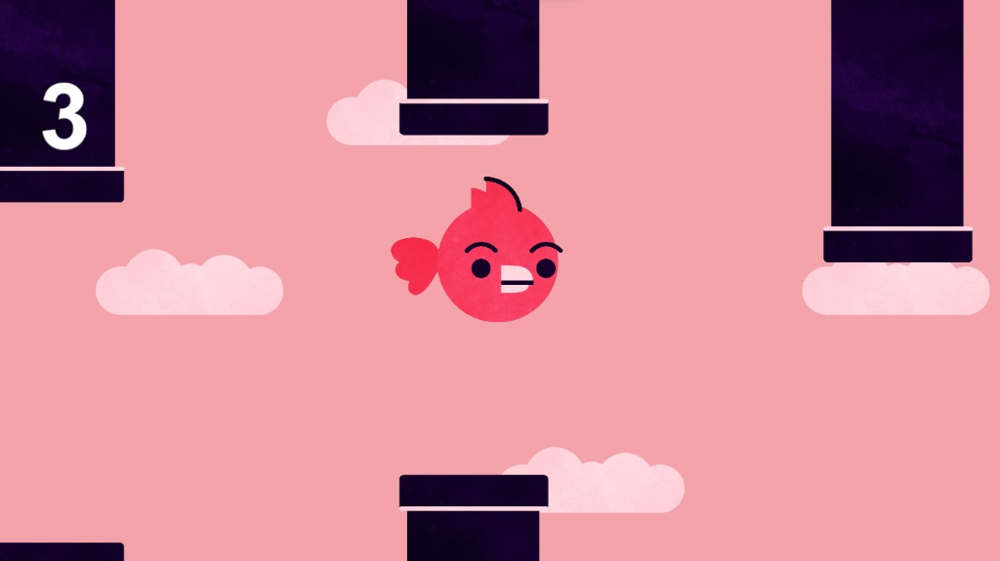
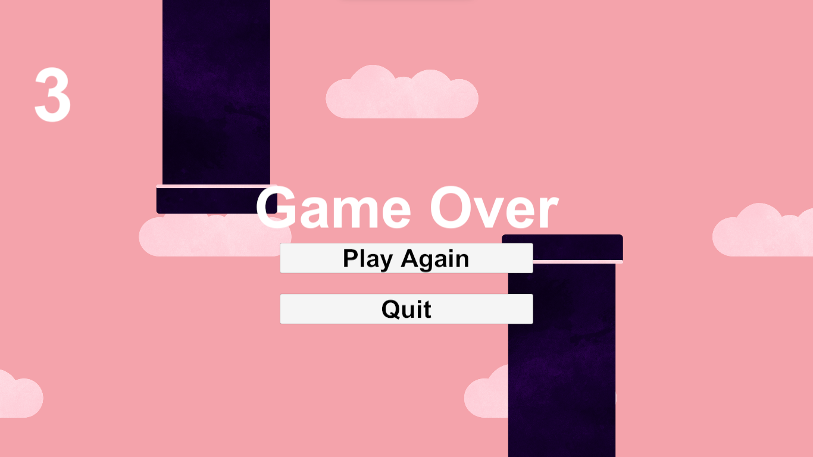

  # 🐦 F L A P P I N G  B I R D
  
  **A Classic Arcade Challenge developed in Unity**

  
  
  
  

   

  > *"A test of patience, timing, and gravity."*

   

  <h3>📸 Gameplay Snapshots</h3>
  
  
  
  

---

## 📂 About The Project

**Flapping Bird** is a 2D arcade-style game developed in 2024. The goal is simple but challenging: navigate the bird through obstacles without crashing. This project serves as a digital archive of the game's final playable build.

* **Genre:** Arcade / Endless Runner
* **Engine:** Unity
* **Original Dev Date:** Feb 2024

---

## 🕹️ Controls & Guidelines

The mechanics are designed to be simple and accessible.

| Action | Control |
| :--- | :--- |
| **Flap / Jump** | <kbd>Spacebar</kbd> |
| **Restart Game** | Click the **Restart** button on the Game Over screen |

---

## 🎮 How to Download & Play

Since this is a compiled build, you don't need Unity to play it.

1.  Navigate to the **[Releases Section](../../releases)** of this repository.
2.  Download the `.zip` file (`FlappyBirdy_Build_2024.zip`).
3.  **Extract** the contents to a folder on your computer.
4.  Double-click **`Flapping Bird.exe`** to launch.
5.  *Enjoy the challenge!*

---

## ⚠️ Repository Note

**This repository contains the binary build only.**
The original source code (`Assets` and `ProjectSettings`) is no longer available. This repository is maintained for archival purposes to ensure the playable version of the game is preserved.

---

  ### 🛠️ Tech Stack
  
  
  

   
  
  Developed by [Mariam] © 2024

